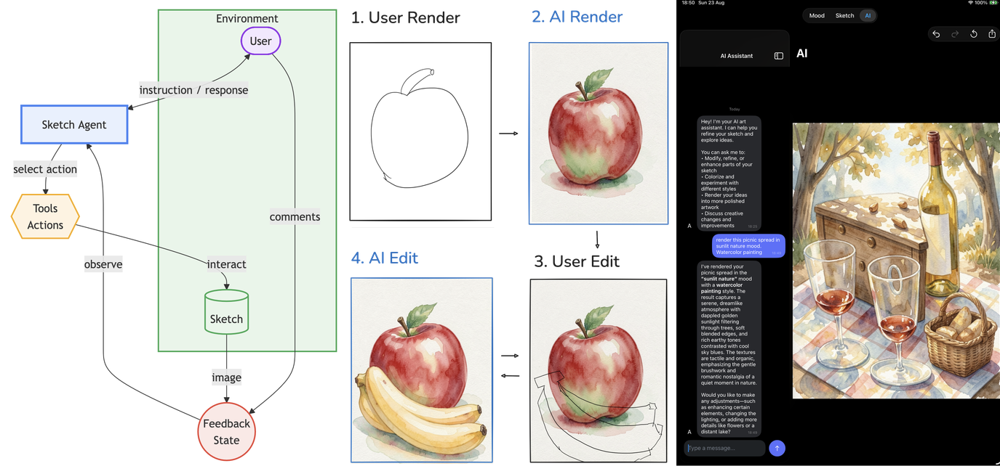
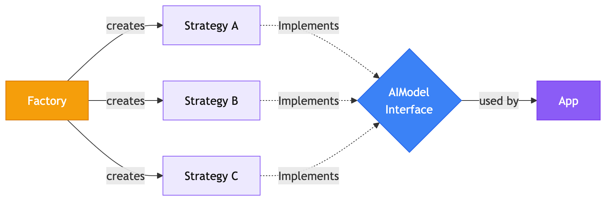
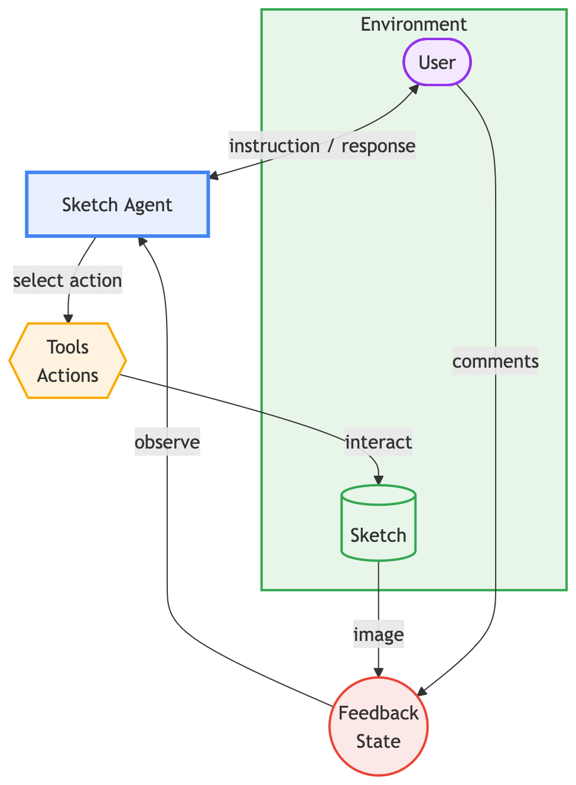
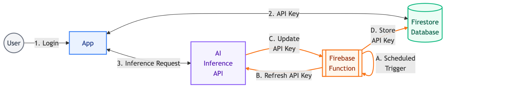

# Broche: Augmenting Rather Than Replacing Artists with Generative AI  
**Name:** Zhu Zhanyan  
**FYP ID:** CCDS25-0989 
**Project Title:**   
**Supervisor:** Prof. Chee Wei Tan   

## Overview


**Broche** is an iPad AI-Assisted Drawing App that explores how AI image generation
can be integrated to accelerate existing artist workflows. It combines a drawing
app with a conversational AI assistant that can understand, render, and edit sketches in different styles. 


## Features
- **Sketch Agent** - An conversational AI assistant, that sees your sketch and can render it in different styles, or edit it based on your instructions.
- **Iterative AI Editing** - Draw over an AI-generated image to indicate changes, then let the agent apply them. No inpainting masks required.
- **Mood Board** - Collect reference images and moods to guide the style of AI generations, similar to a Pinterest pin board.
- **Layered Sketch Architecture** - Drawings are a non-destructive stack of drawing and AI image layers; AI changes can be undone like any other edit.
- **Familiar Drawing UX** - PencilKit drawing with free zoom/rotation, undo/redo gestures (two-finger tap to undo), and PNG export.

## Architecture

### AI Model Inference

Model inference is offloaded to online Inference Provider APIs (OpenRouter and Replicate), although its
implementation makes it AI model provider agnostic.

### Sketch Agent

The Sketch Agent is powered by three AI models behind a common interface: a **text LLM** (reasoning & tool calling), a **VLM** (understanding sketches), and a **Diffusion model** (image generation & editing). 

### API Key Management

Inference Provider API Keys fetched from Firestore by Authenticated users only.
Keys are rotated daily by a scheduled Firebase Cloud Function.

### Tech Stack

- **App**: Swift / SwiftUI, PencilKit, SwiftData, Firebase (Auth & Firestore)
- **AI**: OpenRouter (Qwen3 LLM, GPT-5 Nano VLM), Replicate (FLUX.2 Klein diffusion model)
- **Backend**: Firebase Cloud Functions (Node.js/TypeScript) for API key rotation
- **Testing**: Swift Testing (unit, mocked), integration & UI tests, Vitest (backend)

## Getting Started

### App

1. Open `broche.xcodeproj` in Xcode (requires iOS 26 SDK-era toolchain and an Apple Developer team for signing).
2. Let Swift Package Manager resolve dependencies.
3. Build and run on an iPad simulator or device.
4. Authenticate:
   - **Firebase Sign In** - Sign in with an email/password account.
   - **BYOK (Bring Your Own Keys)** - Tap the *BYOK* tab and enter your OpenRouter and Replicate API tokens directly. No backend needed; tokens are held in memory for the session only.

### Backend
Authenticates user via Firebase Authentication.

A scheduled Firebase Cloud Function that rotates the OpenRouter API key daily. To run locally with emulators or deploy to Firebase:
```bash
A scheduled Firebase Cloud Functions backend rotates the OpenRouter API key daily:

```bash
cd backend/functions
npm install
npm run serve   # run locally with emulators
npm run deploy  # deploy to Firebase
```

## Project Structure

```
├── broche/            # iOS app source (views, models, AI services)
├── brocheTests/       # iOS Unit tests (fully mocked, no network)
├── brocheIntegrationTests/  # iOS Live-API integration tests
└── backend/           # Firebase Cloud Functions (API key rotation)
└── presentation/      # presentation
```
