<!--
theme: default
class: invert
size: 16:9
paginate: true
style: |
  section {
    font-size: 24px;
  }
  section h1 {
    font-size: 2.4em;
  }

  section h2 {
    font-size: 1.6em;
  }
  table {
    font-size: 0.75em;
  }
  small {
    font-size: 0.75em;
  }

  .logo-title {
    display: inline-block;
    margin-top: 0;
    margin-left: 1em;
  }

  .center {
    display: flex;
    justify-content: center;
    align-items: center;
  }

  video {
    height: 50vmin;
    width: auto;
  }
-->

<!-- Presenter: keep to ~30s. Page 1 shows pagination too (requirement: all slides numbered). -->

# Augmenting Rather Than Replacing Artists with Generative AI

**Zhu Zhanyan** · U2320498K

Final Year Project · AY 2026/2027 · CCDS25-0989

Supervisor: Prof. Chee Wei Tan

<small>https://github.com/mrzzy/ntu-fyp</small>

---

<!-- ~30s -->

## Agenda

| Section           | Content                                                                      |
| ----------------- | ---------------------------------------------------------------------------- |
| Background        | Problem, Literature Review, Key Contributions                                |
| Design & Analysis | UI Design, Sketch Agent Design                                               |
| Implementation    | Model Selection, Model Deployment, Performance Optimization, Agent Workflows |
| Results           | Broche Demo                                                                  |
| Discussion        | Limitations                                                                  |
| Conclusion        | Discussion & future work                                                     |

---

# Background

---

<!-- ~1 min -->

## Problem: Role of the Artist in the Age of AI?

- AI image generation for art is now of **decent quality**.
  > “Théâtre D’opéra Spatial” (Midjourney) **won a US regional art award**.
- A human takes **weeks/months per piece**; an image model takes **seconds end-to-end**
  > Can we harness this speed without losing the human’s creative control?

---

<!-- ~45s -->

## Model: AI-Artist Co-creation

**AI–Artist Co-creation**: use AI as a _production tool_ to realise a _human-directed_ vision

**This project:** working model of that co-creation - the **Broche** iPad AI-Assisted Drawing app.

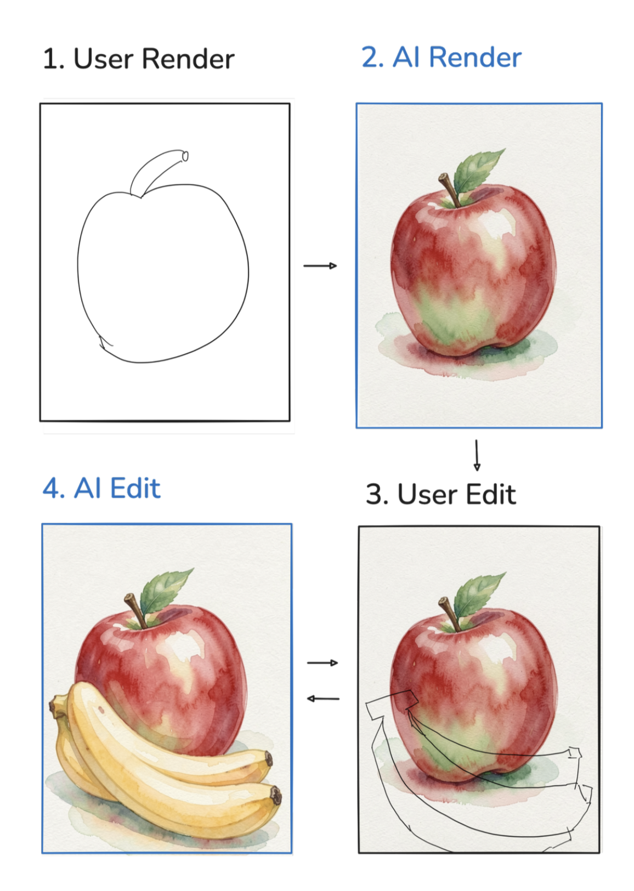

---

<!-- ~1 min: Explored existing tools for AI-Artist Co-creation to analyze what has been done, areas for improvement. -->

## Literature Review: Existing Solutions

  

<h1 class="logo-title">SageBrush</h1>
<h1 class="logo-title">Draw Anything</h1>

---

<!-- ~1 min: High level overview of key contributions. -->

## Key Contributions

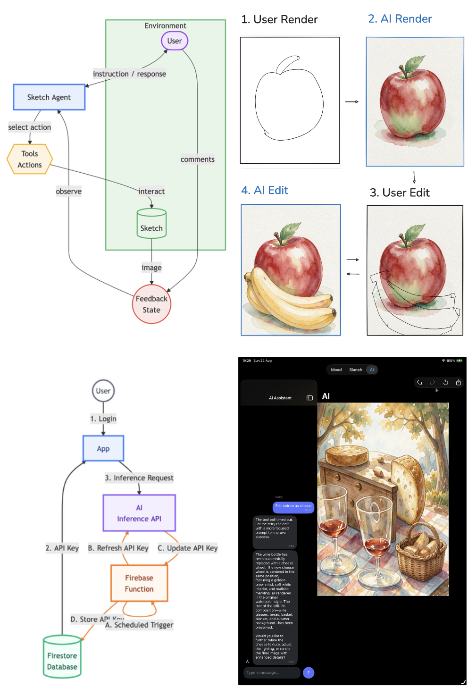

1. **Agentic Sketch Agent** : Sketch agent with user drawing and conversational context awarness.
2. **AI deployment study**: offline vs online deployment model.
3. **Iterative AI-assisted creation**: persistent conversation + _mask-free_ image editing.
4. **Workflow-aligned UI**: mood board, Procreate-like drawing, text messaging interface.

---

# Design & Analysis

---

## Problem: Foreign UI Designs

Existing UI designs are thin wrappers around AI:

- **Hard to Use** Expose model controls directly.
- **Unfamiliar** to Artist's using traditional workflows.

> eg. ComfyUI exposes AI model hyperparameters to the user.

---

<!-- ~1 min -->

## Soluion: Familiar UI Design

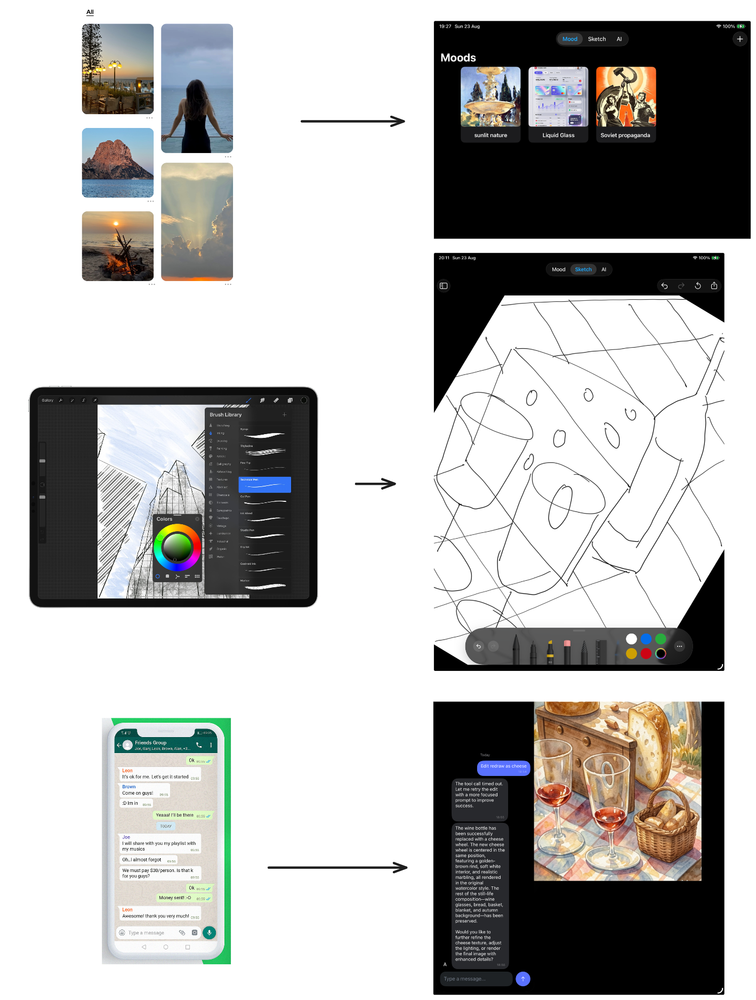

Designed to be familiar to artists:

- **Mood board**: inspired by Pinterest's Pin boards.
- **Sketch View**: familiar drawing canvas from Procreate.
- **Sketch Agent**: familiar text messaging interface to access AI features.

---

<!-- ~1 min -->

## Problem: Prompt Enginering

Mismatch in AI model needs and user willingness to provide:

- Users are lazy: Concise prompts.
- Models need context: Descriptive prompts.

> _“warm sunset”_ vs. _“warm sunset mood, golden hour tones, soft orange/pink gradients…”_

---

<!-- ~1 min -->

## Solution: AI-Assisted Prompt Engineering

Delegate descriptive prompt writing to Language Models (LMs)'s:

- **Generate Prompts** LM's are great at dense textual descriptions.
  > DALL-E 3 Captioner Model performed better then Humans in captioning.
- **In-built Prompt Engineering** Tap in LLM's innate knowledge of AI image prompt engineering.

---

<!-- ~1 min -->

## Problem: No Context Awareness

Existing AI features have limited context awareness:

- **Generation-Intention Misalignment** No subject awareness: AI image different from user intentions.
- **Tiring to use** Users must repeatedly explain their intent.

---

<!-- ~1.5 min -->

## Solution: Context-Aware Sketch Agent

Sketch AI Agent is aware of user intentions:

- **Message History** AI Agent can refer to past userconversation for context.
- **Perception Tools** the agent perceives the user's sketch and intentions via tools:
  - `caption_sketch`: invokes a VLM describes what the user drew.
  - `explain_edit`: invokes a VLM that interprets _drawn_ edit markings.

---

## Solution: Context-Aware Sketch Agent

**Action Tools** the agent can act perceived the user's intentions via tools:

- `render_image`: Generates polished images from user drawings using **Flux.2 Klein 9B**.
- `edit_image`: Applies incremental edits using **Flux.2 Klein 9B**.

---

<!-- ~1 min -->

## Problem: Limited Artist Intevention

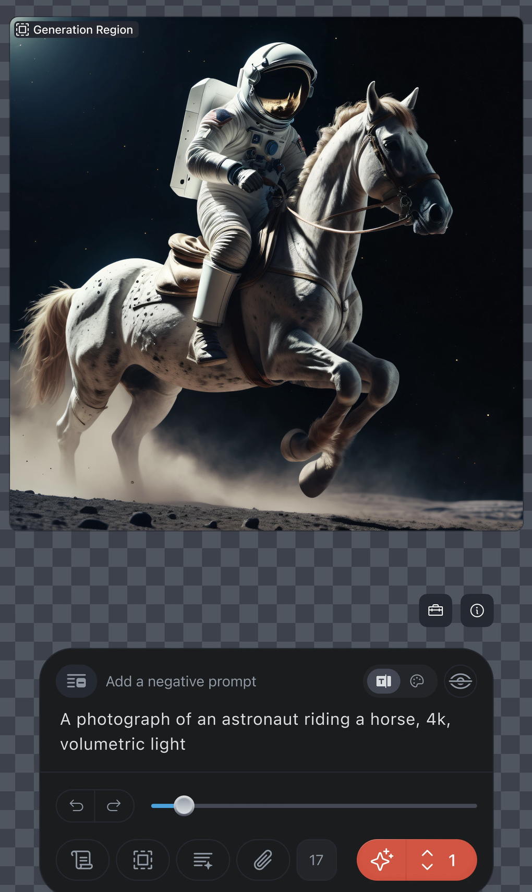

Limited capabilities for artists to refine AI-generated content:

- **Single-shot Generation** text-to-image, no iterative refinement of AI output.
- **Inpainting Masks** regional edits require user provided painting masks.

> eg. Single-shot text-to-image generation in Draw Anything lacks ability to edit and refine.

---

<!-- ~1 min -->

## Solution: Iterative Artist Refinements to AI

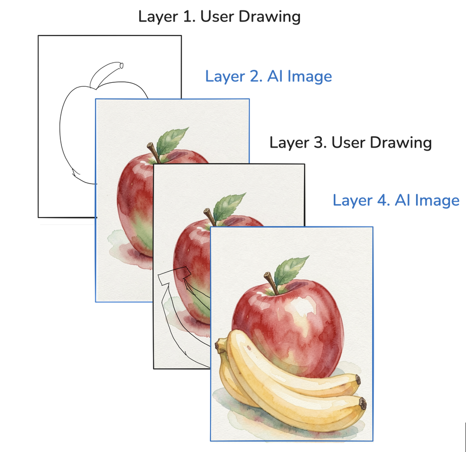

Continued User-AI Agent interaction allows for iterative refinement of piece:

- **Mask Free Editing** Direct image editing with Modern Models (eg. Flux.2 Klein 9B).
- **Drawing Over AI Output** User can keep drawing over AI output to point out desired edits.
- **Layered Architecture** Every AI result lands as a new **layer** → non-destructive undo/redo of AI changes

---

<!-- Now, we will focus on implementation challenges -->

# Implementation

---

## Problem: Model Selection

Many AI Model Variants: Which to chose?

- **High fragmentation:** many AI models families are available.
- **Parameter Size:** Families offer variants with different **parameter sizes**.
- **Quantisation:** Weights support multiple **quantisation methods**.

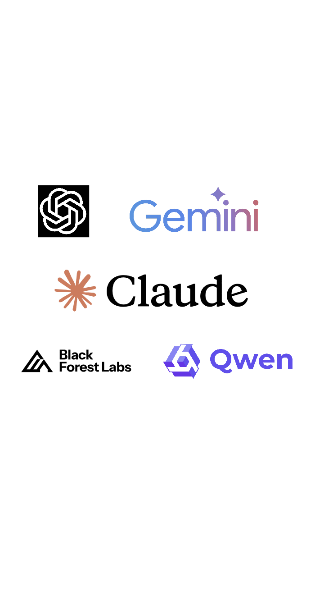

---

## Solution: Model Selection

Selection Criteria: Optise for **cost**, subject to **minimum quality** requirements.

| Role      | Model                  | Why                                  |
| --------- | ---------------------- | ------------------------------------ |
| LLM       | Qwen3-30B-A3B-Instruct | MoE, strong tool-calling, cheap      |
| VLM       | GPT-5 Nano             | Cheapest capable vision model        |
| Diffusion | FLUX.2 Klein 9B        | Best quality/speed; 4-step distilled |

---

<!-- ~1.5 min -->

## Problem: AI Model Deployment

Where do AI models run?

- **Offline deployment** run on-device. e.g. Draw Things, ComfyUI
  - ✓ Stronger privacy and zero inference cost
  - ✕ Limited model support, high resource usage, and deployment complexity
- **Online deployment** run in the cloud. e.g. Wand App, Draw Anything
  - ✓ Broader model capabilities and better device performance
  - ✕ Inference costs and API key security

---

<!-- ~1.5 min -->

## Solution: Online Model Deployment

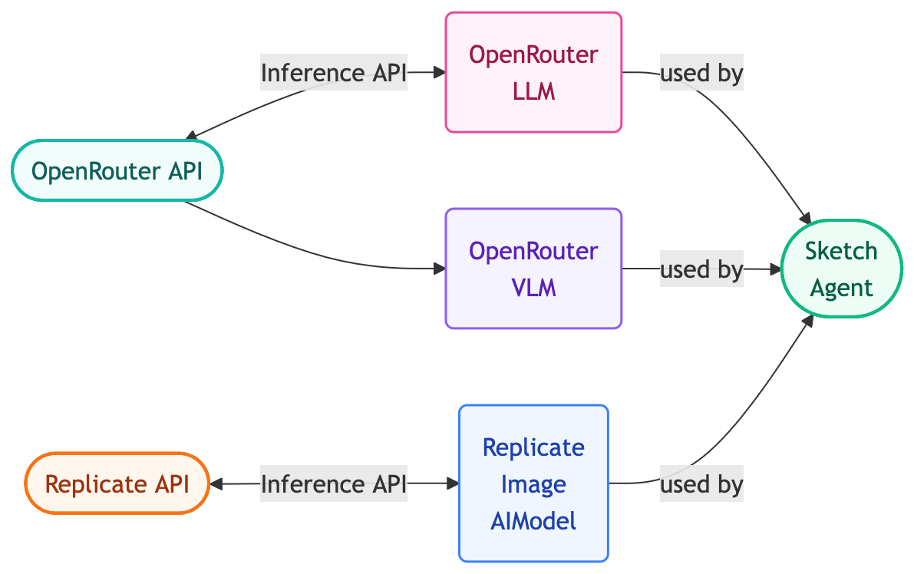

**Online Deployment**: forward model requests to third-party inference providers:

- **OpenRouter** routes LLM/VLM calls to Inference Providers
- **Replicate** serves Image Generation model.

---

<!-- ~1.5 min -->

## Problem: API Key Security

How to securely distribute API keys to users?

| Architecture                      | Security                                             | Complexity / Cost  |
| --------------------------------- | ---------------------------------------------------- | ------------------ |
| CloudKit public DB                | Weak - anyone can read key                           | Low / Low          |
| Auth user + **proxy**             | Strong - key never on device                         | High / High egress |
| Auth user + DB                    | Moderate - long-lived key exposed if app compromised | Low / Low          |
| Auth user + DB + **key rotation** | Moderately strong - short-lived keys limit damage    | Medium / Medium    |

---

## Solution: Scheduled Key Rotation

**Chosen:** Firebase Auth + Firestore + scheduled Firebase Function that **rotates keys** at providers automatically.

---

## Problem: UI Performance

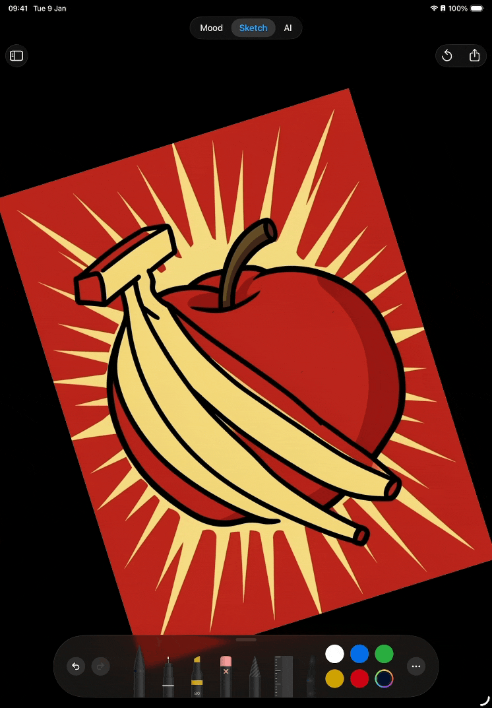

**Performance Issue** seconds-long lag when drawing strokes / panning & zooming

**Profiling** Instruments Profiler to identify bottlenecks:

- **Drawing Stroke**: sidebar previews **rendering** on every SwiftUI refresh.
- **Panning &amp; Zooming**: **re-rendering** every layer on pan/zoom.

---

<!-- ~1 min -->

## Solution: Performance Optimisation

> Observation: Majority of time spent in Rendering.

**Optimisation: Caching** of rendered artifacts:

- Cache rendered preview image; render only on change.
- Cache render all but the top layer; live-render only the top layer.

| Optimisation          | Benchmark                                             | Baseline                  | Optimised               | Speedup |
| :-------------------- | :---------------------------------------------------- | :------------------------ | :---------------------- | :------ |
| **Drawing Stroke**    | 1000 `Sketch.image.getter` calls                      | 21.21 s (21.21 ms/get)    | 41.74 ms (41.74 µs/get) | 508.18× |
| **Panning & Zooming** | 1000 3-layer (Drawing, Image, Drawing) Sketch Renders | 26.88 s (26.88 ms/render) | 5.86 s (5.86 ms/render) | 4.58×   |

---

## Problem: Unreliable Agent Tool Calls

Sketch Agent LLM only issues tools correctly **sometimes**.

- Talks the user without calling tool.
- Does not know which tool to use first.

---

## Solution: Guardrails in System Prompt

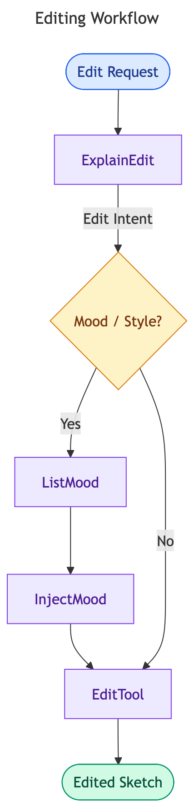
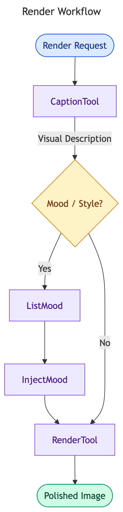

Instruct Agent on tool call workflows in **System Prompt**:

- **Editing Workflow:** to make a **small, targeted change or refinement** to an existing sketch.
- **Rendering Workflow:** to **transform** a rough sketch into a **polished, finished image**.

---

<!-- Work created with Broche App over 3 workloads: Illustration, Graphic Design, UI Design -->

# Results

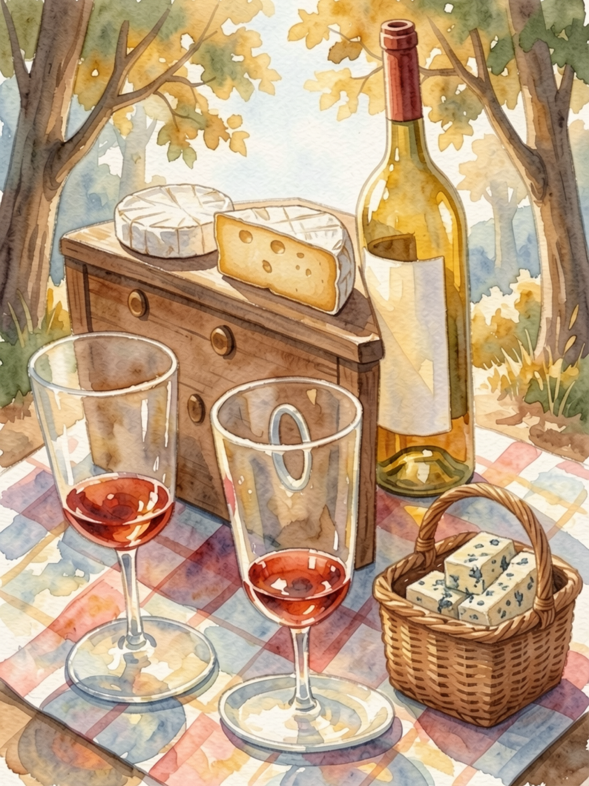

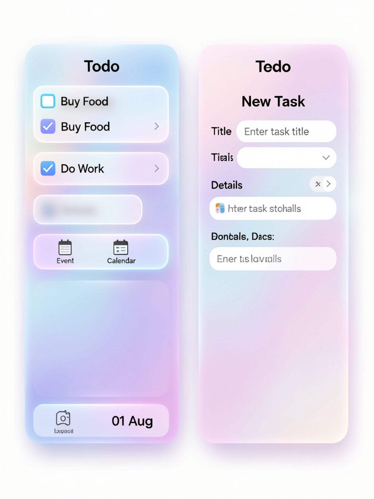

---

## Demo

<!-- ~2.5 min - switch to video here -->

<video controls src="assets/demo.mp4"></video>

Demo: _Illustration of Apple and Banana in Soviet Propaganda Style_

---

# Discussion

---

<!-- ~1.5 min -->

## Limitations

- **Fine control** Lack of fine grain control over exact colours, textures, edges in AI output
- **Text rendering** FLUX.2 Klein clobbers small text (“Enter Task Details”)
- **Edge truncation** subjects clipped near image borders.

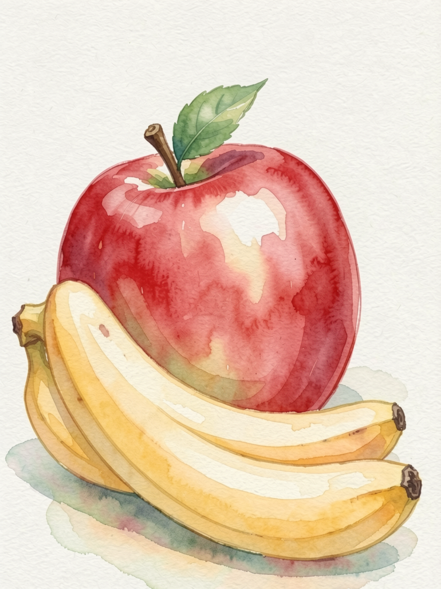

---

<!-- ~30s -->

## Future Work

- **Clarification dialogues** Agent asks before assuming when ambiguous.
- **Fine-grained AI editing** improved AI models.
- **Real User Evaluation** user study on AI-assisted vs. traditional workflow.

---

<!-- ~1 min -->

## Conclusion

Crafted **Broche** iPad AI-Assisted Drawing app:

- **Demonstrates AI-Artist co-creation**: Generative AI can be integrated into artistic workflows.
- **Deployment Models** on-device AI still immature for real-world use.
- **UI Design** aligned with existing user workflows.
- **Limitations** Fine-grained control, hallucination, text rendering, edge truncation, real user evaluation.
- **Future Work** Clarification dialogues, fine-grained AI editing, real user evaluation.

---

## Thank you

**Q/A**

Zhu Zhanyan · U2320498K · AY 2026/2027

<small>Source code: https://github.com/mrzzy/ntu-fyp</small>
